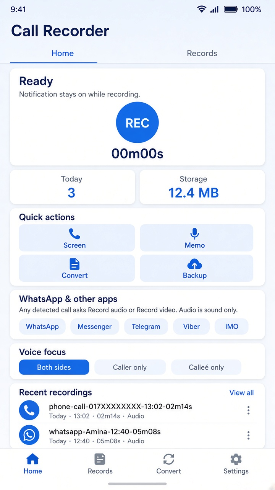
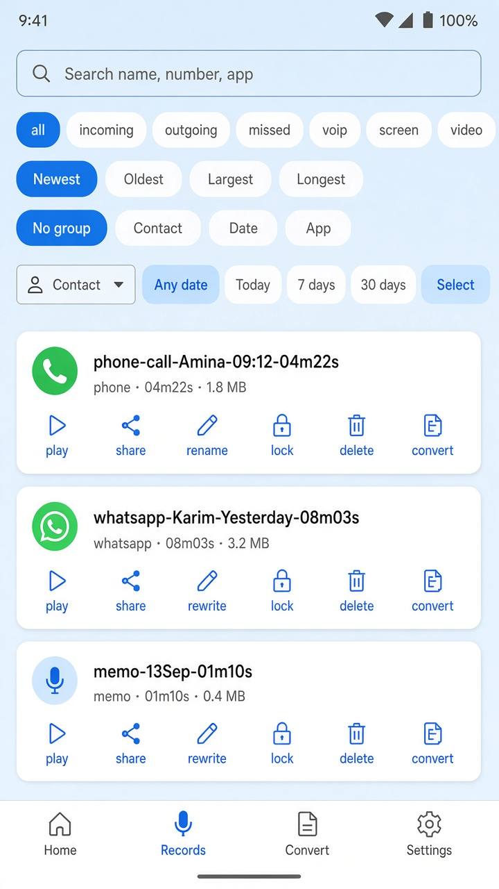
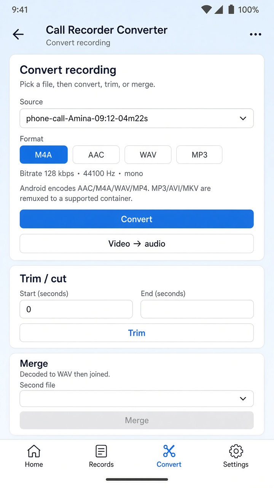
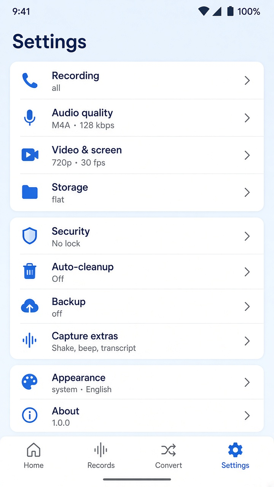
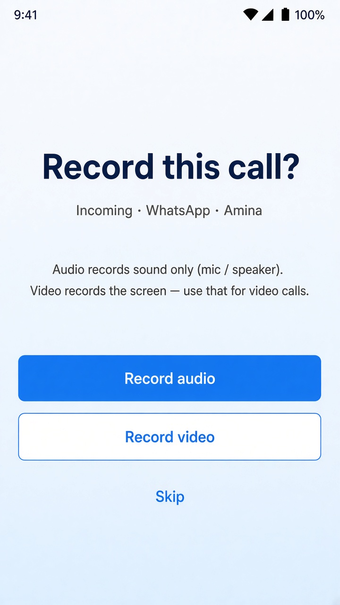

# Universal Android Call Recorder

[](LICENSE)
[](#requirements)
[](#requirements)
[](#build-from-source)
[](#contributing)

A **visible**, open-source call recorder for Android. Record regular phone calls and calling apps such as WhatsApp, Telegram, Messenger, IMO, Viber, WeChat, Signal, Meet, Zoom, and more.

When a call is detected you choose **Record audio** or **Record video**. Voice calls capture sound only. Video is for real video calls (screen + audio).

> **Use it legally.** You are responsible for the recording laws where you live. Some places require every person on the call to consent. This app does **not** hide recording from the other party.

---

## Download the APK

Install the current debug build (v1.0.0) from this repository:

**[Download universal-call-recorder-1.0.0.apk](apk/universal-call-recorder-1.0.0.apk)**

On your phone: allow **Install unknown apps** for the browser or file manager you use, then open the APK.

This is a compiled build for testers and contributors. It is not a Play Store listing.

---

## Screenshots

<p align="center">
  
  
  
  
  
</p>

| Screen | What you see |
| --- | --- |
| **Home** | Centered REC / STOP, today and storage stats, screen / memo / convert / backup |
| **Records** | Search, filters, play, share, rename, lock, convert, notes, PDF |
| **Converter** | M4A / AAC / WAV / MP3 / MP4, trim, merge, video → audio |
| **Settings** | Recording rules, quality, storage, security, backup, extras |
| **Call prompt** | Record audio, Record video, or Skip when a call is detected |

---

## Features

### Capture
- Incoming and outgoing **phone** calls
- Prompt on **any detected call**, including WhatsApp and other calling apps
- **Audio** = microphone / speaker only (no screen)
- **Video** = screen capture for video calls
- Voice memo and standalone screen recording
- Optional consent beep
- Visible notification while recording
- Quick light / dark toggle in the top bar

### Library
- Search by name, number, or app
- Filters: incoming, outgoing, missed, VoIP, screen, video
- Play with waveform, share, rename, lock, delete
- Notes, extractive summary, PDF export
- Encrypted vault (AES-256, Android Keystore)
- Silence trim and multi-select

### Tools
- Convert, trim, and merge recordings
- Backup and restore as ZIP
- English and বাংলা
- PIN / pattern lock, auto-cleanup, home-screen widget, quick-settings tile

---

## What this app cannot do

Android does not give third-party apps a silent tap of WhatsApp / Telegram / similar VoIP audio.

| Call type | What you get |
| --- | --- |
| Regular phone call | In-call audio when the device allows it; otherwise mic / speaker |
| WhatsApp / other **voice** call | Audio only (mic / speaker) after you tap **Record audio** |
| WhatsApp / other **video** call | Screen + audio after you tap **Record video** |

OEM recorders (for example Xiaomi’s built-in tap) use privileged APIs this project does not have. Pull requests that hide recording from the other party, disguise the app, or add malware will not be accepted.

---

## Requirements

- Android 8.0 (API 26) or newer
- Microphone permission
- Phone state (for cellular incoming / outgoing)
- Notification access (so WhatsApp and similar apps can show the record prompt)
- Optional: contacts, call log, usage access, notifications

**Settings → About → Enable call notification access** after install if you want app-call prompts.

---

## Build from source

```bash
git clone https://github.com/jagobandhusome/universal-android-call-recorder-including-calling-apps-like-whatsapp.git
cd universal-android-call-recorder-including-calling-apps-like-whatsapp
```

Open the project in **Android Studio**, or from a terminal with a JDK 17+ (Android Studio’s JBR works):

```bash
# Windows PowerShell example
$env:JAVA_HOME = "C:\Program Files\Android\Android Studio\jbr"
.\gradlew.bat assembleDebug
```

The debug APK is written to:

`app/build/outputs/apk/debug/app-debug.apk`

---

## Project layout

```
app/src/main/java/com/androidcallrecorder/app/
  ui/          Home, Records, Converter, Settings
  record/      Services, call detect, convert, backup
  data/        Settings and recording store
  security/    Lock and vault
apk/           Prebuilt debug APK
screenshots/   UI previews
```

Stack: **Kotlin**, **Jetpack Compose**, Material 3, minSdk 26, targetSdk 36.

---

## Contributing

Contributions are welcome — bug fixes, translations, UI polish, device-specific call detection, and documentation.

1. Fork the repository
2. Create a branch: `git checkout -b fix/your-change`
3. Commit with a short “why” message
4. Open a Pull Request against `main`

Please:

- Keep recording **visible** (notification stays on)
- Do not add stealth, hide-icon, or exploit code
- Match the existing Kotlin / Compose style
- Test on a real device if you change call detection

Ideas that help: more calling-app package IDs, clearer permission onboarding, accessibility, tests, and extra language files.

Open an [issue](https://github.com/jagobandhusome/universal-android-call-recorder-including-calling-apps-like-whatsapp/issues) if you are unsure where to start.

---

## License

This project is licensed under the [GNU General Public License v3.0](LICENSE).

---

## Disclaimer

This software is provided as-is. The authors are not responsible for illegal recording or misuse. Check your local two-party / one-party consent rules before you record anyone.

---

### Tags

`#Android` `#CallRecorder` `#WhatsApp` `#Telegram` `#IMO` `#Viber` `#WeChat` `#VoIP` `#OpenSource` `#FOSS` `#GPLv3` `#Kotlin` `#JetpackCompose` `#Material3` `#AudioRecorder` `#VideoCall` `#PRsWelcome`
